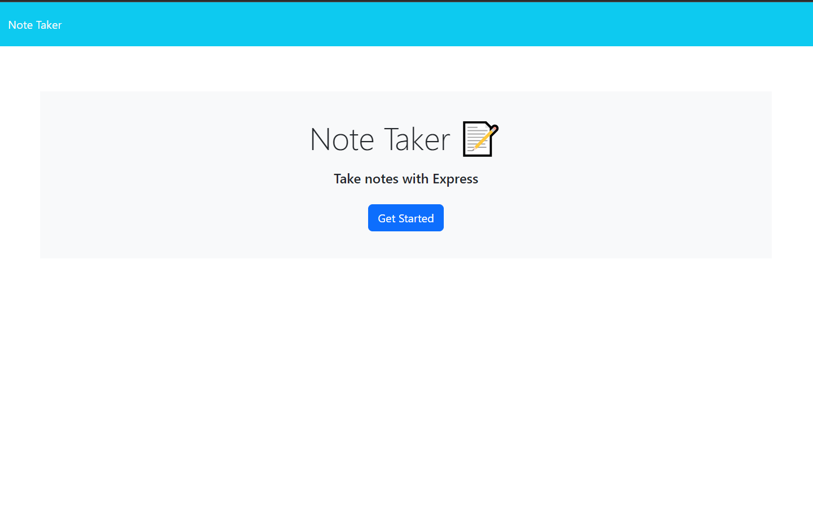

# ReadME Generator

## Description

This Project can be used to mark task to do in a day.

## Languages used

NODE JS & Express.JS

## Table of Contents
  
  - [Installation](#installation)
  - [Usage](#usage)
  - [License](#license)
  - [Contributing](#contributing)
  - [Tests](#tests)
  - [Questions](#questions)

## Installation

    Instructions for installation:
    Deployed Heroku https://notetakerq.herokuapp.com/notes

## Usage

  Used to mark task for the day. 

## ScreenShot of Code
   
  

## Tests
  

## Contact 
  WyattOtto

  Wyattotto87@gmail.com

 ## License 
        This project is covered by MIT license.